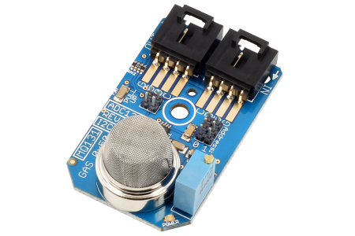

[](https://www.controleverything.com/content/Gas?sku=ADC121C_I2CGAS_MQ131)
# ADC121C_MQ131
ADC121C_MQ131 Ozone Gas Sensor.

The ADC121C_MQ131 Gas sensor makes it easy to monitor ozone concentration levels using our I²C Mini Module form factor.

This Device is available from ControlEverything.com [SKU: ADC121C_I2CGAS_MQ131]

https://www.controleverything.com/content/Gas?sku=ADC121C_I2CGAS_MQ131

This Sample code can be used with Raspberry pi, Arduino, Particle and Beaglebone Black.

## Java
Download and install pi4j library on Raspberry pi. Steps to install pi4j are provided at:

http://pi4j.com/install.html

Download (or git pull) the code in pi.

Compile the java program.
```cpp
$> pi4j ADC121C_MQ131.java
```

Run the java program.
```cpp
$> pi4j ADC121C_MQ131
```

## Python
Download and install smbus library on Raspberry pi. Steps to install smbus are provided at:

https://pypi.python.org/pypi/smbus-cffi/0.5.1

Download (or git pull) the code in pi. Run the program.

```cpp
$> python ADC121C_MQ131.py
```

## Arduino
Download and install Arduino Software (IDE) on your machine. Steps to install Arduino are provided at:

https://www.arduino.cc/en/Main/Software

Download (or git pull) the code and double click the file to run the program.

Compile and upload the code on Arduino IDE and see the output on Serial Monitor.


## Particle Photon

Login to your Photon and setup your device according to steps provided at:

https://docs.particle.io/guide/getting-started/connect/photon/

Download (or git pull) the code. Go to online IDE and copy the code.

https://build.particle.io/build/

Verify and flash the code on your Photon. Code output is shown in logs at dashboard:

https://dashboard.particle.io/user/logs


## C

Download (or git pull) the code in Beaglebone Black.

Compile the c program.
```cpp
$>gcc ADC121C_MQ131.c -o ADC121C_MQ131
```
Run the c program.
```cpp
$>./ADC121C_MQ131
```

#####The code output is the alcohol concentration in mg/l.
